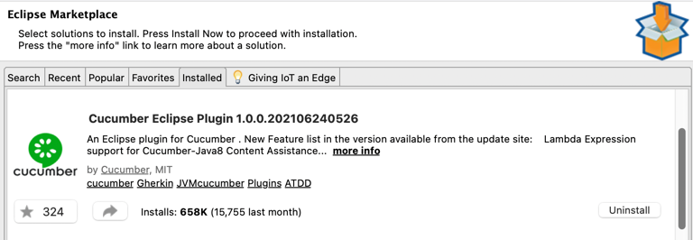
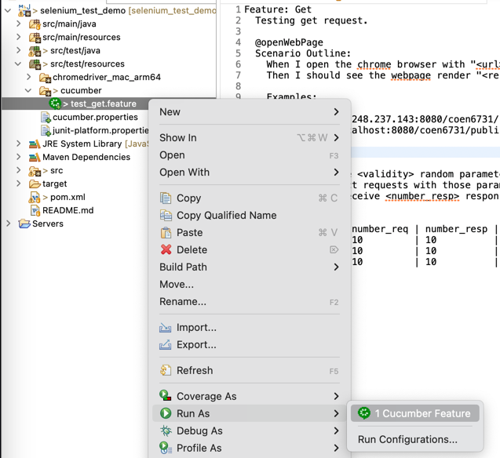
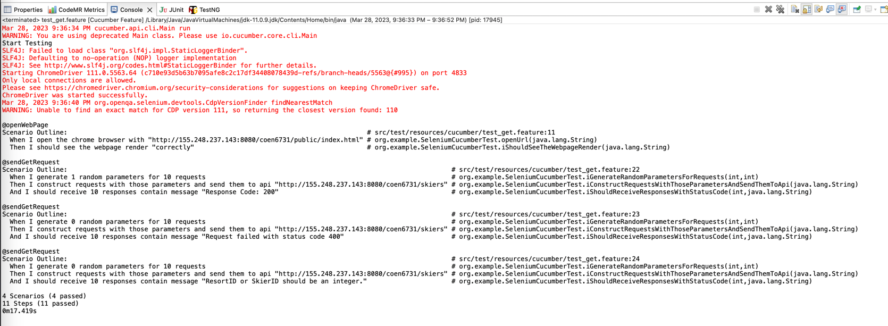

## Important !!!

**The project and the tested web server are for course demonstration purposes.**

**You could try light testing with the Selenium code.**

**But please don't perform heavy batch size.**

**It might crash the server :smile:.**

This is a selenium showcase for course coen448/6761 (Software Testing).
The demo shows how to use Selenium to test a remote webpage.

## Selenium Demo

You can first visit http://168.138.68.114:8080/coen6731/public/index.html.

And if it crashed, please let me know: [jun.huang@concordia.ca](jun.huang@concordia.ca).

You should focus on how to set up the first selenium test maven project.
Material and Tutorial are listed below:

1. [Selenium WebDriver with Java and TestNG. Tutorial designed for complete beginners in Selenium testing and automation](https://concordia.udemy.com/course/selenium-for-beginners/learn/lecture/14351810#overview)
2. [Maven: Using TestNG](https://maven.apache.org/surefire/maven-surefire-plugin/examples/testng.html) (optional)
3. [Selenium](https://www.selenium.dev/)

### ENV Requirement

1. JDK >= 1.8
2. Maven >= 3.6
3. A web browser

For Eclipse User:

**You will need to download the TestNG Plugin.**
https://www.browserstack.com/guide/how-to-install-testng-in-eclipse

### Configure and Download the WebDriver (e.g. Chrome)

DOWNLOAD the chrome driver if you are using chrome older that version 115.

The web driver can be downloaded
at: https://www.selenium.dev/documentation/webdriver/getting_started/install_drivers/#quick-reference

The code for selenium is located at `org.example.SeleniumTest`.
Please edit the following settings to play the test:

``` java 
// how many request
private final Integer batch = 10;

// interval time for waiting the response
private final Integer sl = 100;

@BeforeClass
public void beforeClass() {
    System.out.println("Start Testing");

    // config the chrome driver if you are using chrome older that version 115
    // should download and locate to the correct browser driver
    // and uncomment this
    // System.setProperty("webdriver.chrome.driver", "src/main/resources/chromedriver_mac_arm64/chromedriver");

    // should change to the destination domain
    testUrl = "http://localhost:8080/coen6731/public/index.html";
    endpointUrl = "http://localhost:8080/coen6731/skiers";
}
```

For using the demo, you could change the domain to:

``` java 
testUrl = "http://168.138.68.114:8080/coen6731/public/index.html";
endpointUrl = "http://168.138.68.114:8080/coen6731/skiers";
```

### Run Test with Maven

``` bash 
mvn clean test
```

## Selenium + Cucumber Demo

### Materials

- [What is Behaviour Driven Development (BDD)?](https://cucumber.io/docs/bdd/)
- [10 Minutes Cucumber Showcase](https://cucumber.io/docs/guides/10-minute-tutorial/?lang=java)
- [Gherkin Syntax](https://cucumber.io/docs/gherkin/reference/)
- [Maven Dependence](https://cucumber.io/docs/installation/java/)

### Cucumber & BDD in This Project

We demonstrate how to use cucumber and BDD to perform the GET request testing we did
in `org.example.SeleniumTest.getTest`.

1. Define feature file in the resources folder `src/test/resources`.

   The first scenario is for opening chrome and visiting the link.

   The second scenario is for defining multiple instances of the get request testing.
    ``` cherkin 
    Feature: Get
      Testing get request.
    
      @openWebPage
      Scenario Outline:
        When I open the chrome browser with "<url>"
        Then I should see the webpage render "<result>"
    
        Examples:
          | url                                                    | result    |
          | http://168.138.68.114:8080/coen6731/public/index.html | correctly |
    #      | http://localhost:8080/coen6731/public/index.html       | correctly |
    
      @sendGetRequest
      Scenario Outline:
        When I generate <validity> random parameters for <number_req> requests
        Then I construct requests with those parameters and send them to api "<api_endpoint>"
        And I should receive <number_resp> responses contain message "<response_text>"
    
        Examples:
          | validity | number_req | number_resp | response_text                             | api_endpoint                                |
          | 1        | 10         | 10          | Response Code: 200                        | http://168.138.68.114:8080/coen6731/skiers |
          | 0        | 10         | 10          | Request failed with status code 400       | http://168.138.68.114:8080/coen6731/skiers |
          | 0        | 10         | 10          | ResortID or SkierID should be an integer. | http://168.138.68.114:8080/coen6731/skiers |
    ```

2. Implement the Scenarios in `org.example.SeleniumCucumberTest`. We have five steps therefore we need five step
   implementations.
   ``` java 
   @When("I open the chrome browser with {string}")
    public void openUrl(String url) {
        // code
    }

    @Then("I should see the webpage render {string}")
    public void iShouldSeeTheWebpageRender(String arg0) {
        // code
    }

    @When("I generate {int} random parameters for {int} requests")
    public void iGenerateRandomParametersForRequests(int parameterValidity, int numberOfRequest) {
        // code
    }

    @Then("I construct requests with those parameters and send them to api {string}")
    public void iConstructRequestsWithThoseParametersAndSendThemToApi(String apiEndpoint) {
        // code
    }

    @Then("I should receive {int} responses contain message {string}")
    public void iShouldReceiveResponsesWithStatusCode(int numberOfResponse, String responseText) {
        // code 
    }
   ```
   
3. Run the cucumber test. 
   1. IDE agnostic way: 
      ``` bash
      mvn test
      ```
   2. Eclipse: 
   
      Install the cucumber plugin: 
      
   
      Run as cucumber features:
      
   3. IDEA should be easy. 

4. Expected Result
   